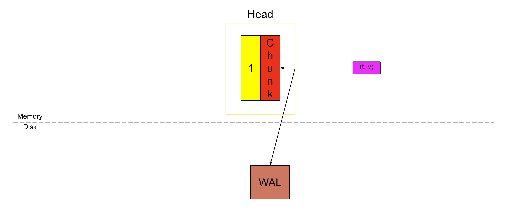
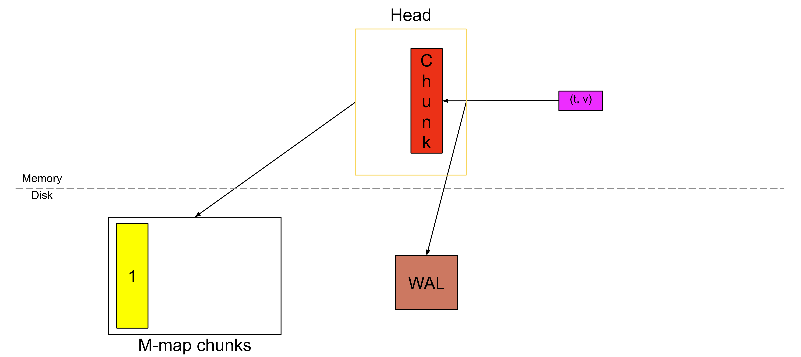

## 引言

在 Prometheus TSDB 博客系列的[第一部分](https://blog.zhiyuanzhou.online/observability/szutn)中，提到过：一旦一个 chunk 被“填满”，它就会被刷写到磁盘上，并通过 memory map（内存映射）的方式加载。这种设计有助于降低 Head block 的内存占用，同时也能加快我们在[第二部分](https://blog.zhiyuanzhou.online/observability/qikad)中讨论过的 WAL 重放（replay）速度。在这篇博客中，将更深入地探讨 Prometheus 是如何实现这一机制的。

由于这是撰写 Prometheus TSDB 博客系列的一部分，建议你先阅读第一部分，以了解这些内存映射的 chunk 在 TSDB（或 Head block）中的位置；再阅读第二部分，以理解 WAL 重放的工作原理。

另外， [KubeCon](https://www.youtube.com/watch?v=suMhZfg9Cuk) 上有相关的分享，可以从更高的层面讲解了这一设计思路。

## 写入这些 chunks

回顾第一部分的内容：当一个 chunk 被写满之后，我们会切换（cut）到一个新的 chunk，而旧的 chunk 就会变成不可变（immutable）的，只能被读取（如下图中黄色的部分）。


并且我们不会再把它存放在内存中，而是将其刷写到磁盘上，并保存一个引用，以便之后能够再次访问它。

这个被刷写到磁盘上的 chunk，就是从磁盘进行内存映射的 chunk。这里不可变性是最关键的因素，否则如果每个样本都需要重写已压缩的 chunk，效率将会非常低。

## 磁盘上的格式

该格式[也可以在 GitHub 上找到](https://github.com/prometheus/prometheus/blob/main/tsdb/docs/format/head_chunks.md)。

### 文件

这些 chunk 会存放在一个名为 chunks_head 的独立目录中，文件序号的规则与 WAL 类似（不过是从 1 开始）。例如：

```
data
├── chunks_head
|   ├── 000001
|   └── 000002
└── wal
    ├── checkpoint.000003
    |   ├── 000000
    |   └── 000001
    ├── 000004
    └── 000005
```

单个文件的最大大小被限制为 128MiB。接下来深入看一个文件的内部结构，这个文件包含一个 8 字节的文件头。

```
┌──────────────────────────────┐
│  magic(0x0130BC91) <4 byte>  │
├──────────────────────────────┤
│    version(1) <1 byte>       │
├──────────────────────────────┤
│    padding(0) <3 byte>       │
├──────────────────────────────┤
│ ┌──────────────────────────┐ │
│ │         Chunk 1          │ │
│ ├──────────────────────────┤ │
│ │          ...             │ │
│ ├──────────────────────────┤ │
│ │         Chunk N          │ │
│ └──────────────────────────┘ │
└──────────────────────────────┘

```

Magic Number 是一个用于唯一标识该文件为“内存映射 Head chunks 文件”的数值。由于这个特性是Ganesh Vernekar实现的，这里设置成了他的生日。Chunk Format（版本号）用于说明如何对文件中的 chunk 进行解码。额外的 padding 是为了将来可能需要扩展文件头字段而预留的空间。

在文件头之后，紧接着存放的就是各个 chunk。

### Chunks

单个 chunk 的结构如下所示：

```
┌─────────────────────┬───────────────────────┬───────────────────────┬───────────────────┬───────────────┬──────────────┬────────────────┐
| series ref <8 byte> | mint <8 byte, uint64> | maxt <8 byte, uint64> | encoding <1 byte> | len <uvarint> | data <bytes> | CRC32 <4 byte> |
└─────────────────────┴───────────────────────┴───────────────────────┴───────────────────┴───────────────┴──────────────┴────────────────┘

```

**series ref** 是在第二部分中提到过的同一个 series 引用，它是用于在内存中访问时间序列的 series ID。**mint** 和 **maxt** 分别表示该 chunk 中样本所包含的最小时间戳和最大时间戳。**encoding** 表示用于压缩该 chunk 的编码方式。len 是从当前位置开始，后续数据的字节数，而 **data** 则是实际的、经过压缩的 chunk 数据。

**CRC32** 是对上述 chunk 内容计算得到的校验和，用于检查数据的完整性。

## 读取这些 chunks

对于每一个 chunk，Head block 都会在内存中保存该 chunk 的 mint 和 maxt，以及一个用于访问它的引用。

这个引用长度为 8 字节。前 4 个字节表示该 chunk 所在的文件编号，后 4 个字节表示该 chunk 在文件中的起始偏移量（也就是 **series ref** 的第一个字节所在的位置）。如果某个 chunk 位于文件 **00093** 中，并且它的 **series ref** 从文件内的第 **1234** 个字节开始，那么这个 chunk 的引用值就是 **(93 << 32) | 1234**（先进行左移操作，再做按位或）。

之所以在 Head 中存储 **mint** 和 **maxt**，是为了在不访问磁盘的情况下就能筛选出合适的 chunk。当确实需要访问某个 chunk 时，我们只会根据这个引用去读取它的 encoding 和 chunk 数据。

在代码层面，每个文件看起来就像是一个普通的字节切片（每个文件对应一个 slice），通过访问某个索引位置即可获取 chunk 数据，而在底层，操作系统会将这个切片通过内存映射的方式映射到磁盘。[磁盘的内存映射](https://en.wikipedia.org/wiki/Memory-mapped_file)是操作系统提供的一项特性，它只会把正在被访问的那一部分文件加载到内存中，而不是一次性把整个文件都读入内存。

## 启动时的重放

在[第二部分](https://blog.zhiyuanzhou.online/observability/qikad)中，我们讨论了 WAL 重放：需要逐条重放每一个样本，以重新构建压缩后的 chunk。现在，由于完整的、已经压缩好的 chunk 已经被刷写到磁盘上，我们就不再需要重新构建这些 chunk 了；只需要为那些尚未写满、仍然存在于 WAL 中的 chunk 进行重建即可。基于这些从磁盘进行内存映射的 chunk，启动时的重放流程如下。

在启动时，首先遍历 **chunks_head** 目录中的所有 chunk 文件，在内存中构建一个映射关系：

```
series ref -> [list of chunk references along with mint and maxt belonging to this series ref]
```

随后继续按照[第二部分](https://blog.zhiyuanzhou.online/observability/qikad)中描述的方式进行 WAL 重放，但会有一些改动：

* 当遇到 **Series** 记录时，在创建完该 series 之后，会在上述映射中查找对应的 series ref；如果存在内存映射的 chunk，就将这一组 chunk 列表关联到该 series 上。
* 当遇到 **Samples** 记录时，如果该样本对应的 series 已经存在内存映射的 chunk，并且该样本的时间戳落在这些 chunk 所覆盖的时间范围内，那么就会跳过这个样本；如果不在覆盖范围内，则将该样本写入 Head block。

## 这一改进带来的增强

既然我们本可以只把 chunk 存放在内存和 WAL 中，为什么还要引入这样一套额外的复杂机制呢？这个特性是在 2020 年才加入的，我们来看看它到底带来了哪些收益。（你可以在这篇 [Grafana Labs 的博客中看到一些基准测试图表](https://grafana.com/blog/new-in-prometheus-v2-19-0-memory-mapping-of-full-chunks-of-the-head-block-reduces-memory-usage-by-as-much-as-40/)）

### 内存节省

如果需要把 chunk 存放在内存中，它通常会占用 120～200 字节（具体大小还取决于样本的可压缩性，甚至可能更大）。现在，这部分被替换为仅 24 字节 - 分别是 chunk 引用、最小时间（mint）和最大时间（maxt），各占 8 字节。

乍一看，这似乎意味着内存占用减少了 80%～90%，但实际情况并没有这么理想。因为 Head 还需要存储更多内容，比如内存中的索引、所有的符号表（标签值），以及 TSDB 中其他会占用内存的部分。

在真实的生产环境中，根据样本抓取频率以及新时间序列创建的速度（也就是常说的 “churn”），内存占用通常可以降低 15%～50%。另外需要注意的是，如果运行了一些查询，涉及大量位于磁盘上的 chunk，那么这些 chunk 仍然需要被加载到内存中进行处理，因此这并不是对峰值内存使用的绝对降低。

### 更快的启动速度

WAL 重放是启动过程中最耗时的部分，主要慢在两点：(1) 从磁盘解码 WAL 记录；(2) 从单个样本重新构建压缩后的 chunk。这两个步骤都是重放过程中的性能瓶颈，而遍历内存映射的 chunk 相对来说要快得多。

我们无法避免对 WAL 记录的解码，因为需要检查所有记录。但正如前面在重放流程中提到的那样，对于时间范围已经被内存映射 chunk 覆盖的样本，我们会直接跳过，从而避免重新创建那些已经完整的压缩 chunk，这样就能在重放阶段节省不少时间。实践中，这一优化通常可以将启动时间缩短约 15%～30%。

## 垃圾回收

内存中的垃圾回收发生在 Head 截断（truncation）过程中，此时只会丢弃那些时间早于截断时间 **T** 的 chunk 引用，但这些 chunk 文件本身仍然保留在磁盘上。和 WAL 段文件类似，我们也需要定期删除旧的内存映射 chunk 文件。

对于每一个存在的内存映射 chunk 文件（也意味着该文件在 TSDB 中是打开的），我们都会在内存中保存该文件内所有 chunk 的绝对最大时间戳 。对于正在写入 chunk 的“活跃文件”，每当有新的 chunk 写入时，都会同步更新这个最大时间戳。在重启过程中，当遍历所有内存映射 chunk 时，也会恢复这些文件在内存中的最大时间戳信息。

因此，当 Head 针对时间 **T** 之前的数据进行截断时，会对这些文件执行截断操作。最大时间戳小于 **T** 的文件（活跃文件除外）会在此时被删除，同时保持文件序列的连续性（例如文件序号为 **5、6、7、8**，如果 **5** 和 **7** 的数据都早于时间 **T**，那么只会删除 **5**，剩余的文件序列仍然是 **6、7、8**）。

在完成截断之后，会关闭当前的活跃文件并创建一个新的文件。这样做的原因是，在数据量较小、写入速率较低的场景下，达到单个文件的最大大小可能需要很长时间；此时通过轮转文件，可以在下一次截断时更容易清理掉旧的 chunk。

参考文献：

https://ganeshvernekar.com/blog/prometheus-tsdb-mmapping-head-chunks-from-disk/
